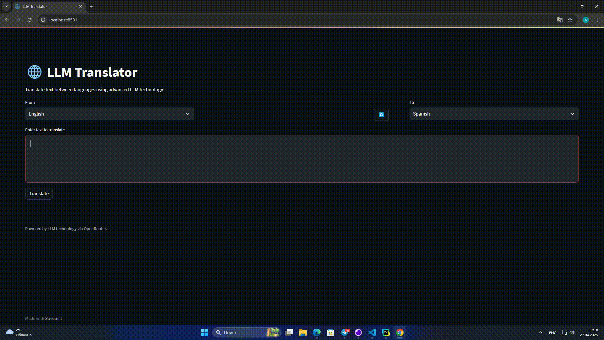

# LLM Translator

Переводчик с поддержкой множества языков, использующий OpenRouter API



## Основные возможности

- **Поддержка 10+ языков** (английский, русский, китайский, испанский и другие)
- **Интерфейс** с возможностью быстрого переключения языков
- **Проверка качества** перевода
- **Мультимодельный подход** (DeepSeek, Llama и другие)
- **Контейнеризированное развертывание** через Docker

## Архитектура 

### Frontend (Streamlit)
- **Интуитивно понятный интерфейс** с переключателем языков
- **Мгновенная обработка ввода** 
- **Визуальные уведомления** о статусе перевода

### Backend (FastAPI)
- **REST API** с валидацией запросов
- **Мультимодельная система** - автоматический выбор LLM
- **Подробное логирование** всех операций
  
  
## Getting Started!

### Требования

- Установленные Docker и Docker Compose
- API-ключ от OpenRouter

### Установка

1. Необходимо клонировать этот репозиторий
2. Создайте файл .env и добавьте ваш API-ключ:
   ```
   OPENROUTER_API_KEY=your_api_key_here
   SITE_URL=your_site_url_here
   SITE_NAME=LLM Translator
   ```
3. Запустите контейнер
   ```
   docker-compose up -d
   ```
4. Откройте приложение на http://localhost:8501


## Разработка
Для локальной разработки 
```bash
# Установка зависимостей
pip install -r backend/requirements.txt
pip install -r frontend/requirements.txt

# Запуск backend (FastAPI)
cd backend && uvicorn app:app --reload

# Запуск frontend (Streamlit)
cd frontend && streamlit run app.py
```


## Участники
- [Артем Сухов](https://github.com/sukhovtema)
- [Оксана Захарова](https://github.com/OksZkh) 
- [Александра Скитская](https://github.com/skitskayaav)
- [Алексеев Андрей](https://github.com/AlekseevDS21) 
